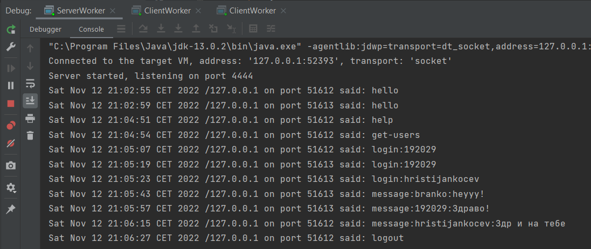
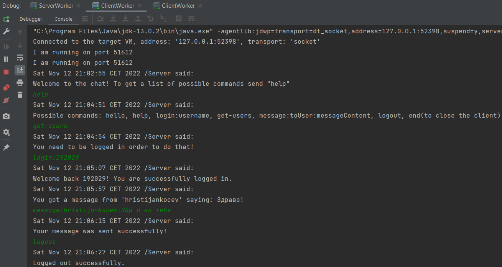
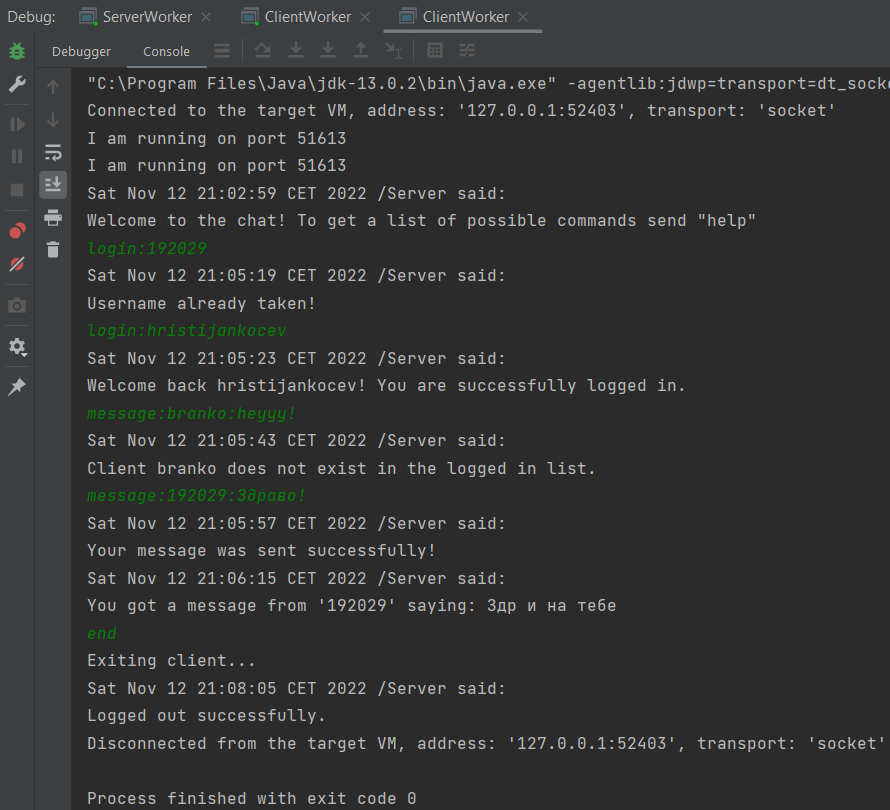

# Chat client in Java implemented using UDP

###### *Laboratory assignment 1 on the subject 'Distributed Systems'*

### Functionalities

- Client tests the connection to the server
- The server responds with a hello message
- The client can get a list of available commands by sending a `help` command
- Client logs onto the server using the command `login:username`
- The server maps the given username to a (k,v) pair in a `Hashtable<String, List<String>>`
    - example entry `'hristijankocev', ('127.0.0.1', '54006')`

- As a logged-in user you can:
    - get a list of logged in users: `get-users`
    - send a message to another user: `message:toUser:messageContent`
      - if the client sends a message to himself, the server will just echo the message back
    - logout: `logout`
        - the server deletes the entry for that user in the Hashtable

- From the client side:
    - typing `end` closes the client and sends a `logout` message to the server

> If the client sends a message that the server won't understand, the server replies with an "Unknown command" message and a list of commands that the user can send.

### Configuration

Some protocol configuration properties are defined in the ProtoConfig.java Enum class.

- There, we can set constants such as:
    - UDP packet size
    - server listening port
    - constant messages used between the server and the client  

## Example communication

#### *The console of the server:*

#### *The console of client-1:*

#### *The console of client-2:*

