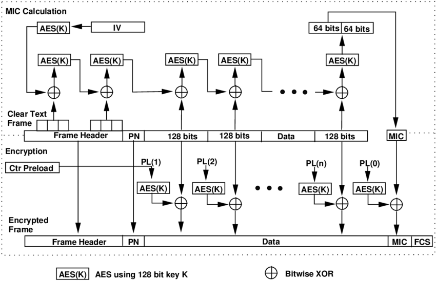
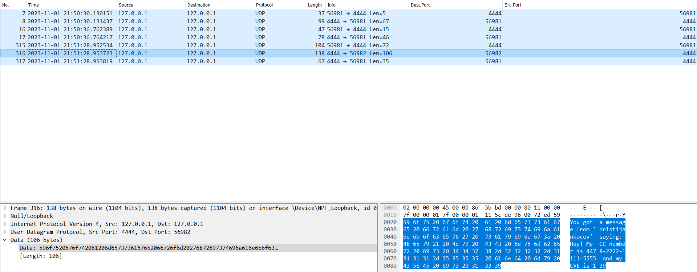
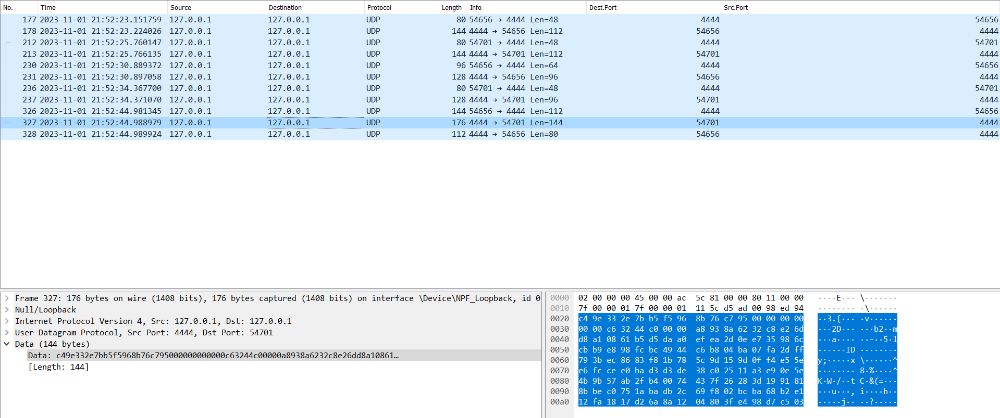

# Chat client in Java implemented using UDP

###### *Laboratory assignment 1 on the subject 'Distributed Systems'*

### Functionalities

- Client tests the connection to the server
- The server responds with a hello message
- The client can get a list of available commands by sending a `help` command
- Client logs onto the server using the command `login:username`
- The server maps the given username to a (k,v) pair in a `Hashtable<String, List<String>>`
    - example entry `'hristijankocev', ('127.0.0.1', '54006')`

- As a logged-in user you can:
    - get a list of logged in users: `get-users`
    - send a message to another user: `message:toUser:messageContent`
        - if the client sends a message to himself, the server will just echo the message back
    - logout: `logout`
        - the server deletes the entry for that user in the Hashtable

- From the client side:
    - typing `end` closes the client and sends a `logout` message to the server

> If the client sends a message that the server won't understand, the server replies with an *"Unknown command"* message and a list of commands that the user can send.

### Configuration

Some protocol configuration properties are defined in the ProtoConfig.java Enum class.

- There, we can set constants such as:
    - UDP packet size
    - server listening port
    - constant messages used between the server and the client

### Usage

- Start the server by running the Server.java main function
- Start as many clients as you want by running the ClientWorker.java main function
  > *If you want to run multiple clients, make sure to enable the run option "Allow multiple instances" for the ClientWorker.java class (in the case of IntelliJ)*

## Example communication

#### *Server console:*

> Connected to the target VM, address: '127.0.0.1:64058', transport: 'socket'  
> Server started, listening on port 4444  
> Sun Nov 13 16:05:50 CET 2022 /127.0.0.1 on port 57007 said: hello  
> Sun Nov 13 16:05:53 CET 2022 /127.0.0.1 on port 57008 said: hello  
> Sun Nov 13 16:05:59 CET 2022 /127.0.0.1 on port 57007 said: help  
> Sun Nov 13 16:06:03 CET 2022 /127.0.0.1 on port 57007 said: get-users  
> Sun Nov 13 16:06:13 CET 2022 /127.0.0.1 on port 57007 said: message:hristijan:hey  
> Sun Nov 13 16:06:28 CET 2022 /127.0.0.1 on port 57007 said: message:hristijan:hey:test  
> Sun Nov 13 16:06:34 CET 2022 /127.0.0.1 on port 57007 said: login:192029  
> Sun Nov 13 16:06:40 CET 2022 /127.0.0.1 on port 57008 said: login:hristijan  
> Sun Nov 13 16:06:54 CET 2022 /127.0.0.1 on port 57007 said: message:hristijan:Здраво!  
> Sun Nov 13 16:07:06 CET 2022 /127.0.0.1 on port 57008 said: message:192029:Здраво и на тебе!  
> Sun Nov 13 16:07:16 CET 2022 /127.0.0.1 on port 57008 said: logout  
> Sun Nov 13 16:07:38 CET 2022 /127.0.0.1 on port 57007 said: message:hristijan:Whats up ?  
> Sun Nov 13 16:07:43 CET 2022 /127.0.0.1 on port 57007 said: logout

#### *Client 1 console:*

> Connected to the target VM, address: '127.0.0.1:64063', transport: 'socket'  
> Sending thread started on port: 57007  
> Listener thread started on port: 57007  
> Sun Nov 13 16:05:50 CET 2022 /Server said:  
> Welcome to the chat! To get a list of possible commands send "help"  
> help  
> Sun Nov 13 16:05:59 CET 2022 /Server said:  
> Possible commands: hello, help, login:username, get-users, message:toUser:messageContent, logout, end(to close the client)  
> get-users  
> Sun Nov 13 16:06:03 CET 2022 /Server said:  
> You need to be logged in order to do that!  
> message:hristijan:hey  
> Sun Nov 13 16:06:13 CET 2022 /Server said:    
> You need to be logged in order to do that!    
> message:hristijan:hey:test  
> Sun Nov 13 16:06:28 CET 2022 /Server said:    
> You need to be logged in order to do that!  
> login:192029  
> Sun Nov 13 16:06:34 CET 2022 /Server said:  
> Welcome back 192029! You are successfully logged in.  
> message:hristijan:Здраво!  
> Sun Nov 13 16:06:54 CET 2022 /Server said:  
> Your message was sent successfully!  
> Sun Nov 13 16:07:06 CET 2022 /Server said:  
> You got a message from 'hristijan' saying: Здраво и на тебе!  
> message:hristijan:Whats up ?  
> Sun Nov 13 16:07:38 CET 2022 /Server said:  
> Client hristijan does not exist in the logged in list.  
> end  
> Exiting client...  
> Disconnected from the target VM, address: '127.0.0.1:64063', transport: 'socket'    
> Process finished with exit code 0

#### *Client 2 console:*

> Connected to the target VM, address: '127.0.0.1:64068', transport: 'socket'  
> Listener thread started on port: 57008  
> Sending thread started on port: 57008  
> Sun Nov 13 16:05:53 CET 2022 /Server said:  
> Welcome to the chat! To get a list of possible commands send "help"  
> login:hristijan  
> Sun Nov 13 16:06:40 CET 2022 /Server said:  
> Welcome back hristijan! You are successfully logged in.  
> Sun Nov 13 16:06:54 CET 2022 /Server said:  
> You got a message from '192029' saying: Здраво!  
> message:192029:Здраво и на тебе!  
> Sun Nov 13 16:07:06 CET 2022 /Server said:  
> Your message was sent successfully!  
> logout  
> Sun Nov 13 16:07:16 CET 2022 /Server said:  
> Logged out successfully.  
> end  
> Exiting client...  
> Disconnected from the target VM, address: '127.0.0.1:64068', transport: 'socket'  
> Process finished with exit code 0    

## CCMP (Counter Mode Cipher Block Chaining Message Authentication Code Protocol) extension

For the purpose of another exercise from the "Information Security" class, I extended this chat application with a 
simplified freestyle version of CCMP.

The goal is to add **confidentiality** and **integrity** for the exchanged messages
between the clients and the server. We suppose that both parties have previously exchanged the encryption key in a 
secure manner.

**The packet structure:**

| Field                        | Size (Bytes) |
|:-----------------------------|:-------------|
| MAC Header                   | 12           |
| Packet Number                | 6            |
| Frame Header                 | 6            |
| Data (variable size)         | -            |
| MIC (Message Integrity Code) | 8            |

The encapsulation process is done as shown on the diagram:

In the first stage (data integrity) the **MIC** is generated in a **CBC** (Cypher-Block Chaining) mode: 
  - generate an **IV** (Initialization Vector) or so a called **nonce** (number only used once) 104 bits size
      - 48 bit Packet Number
      - 48 bit Source MAC
      - 8 bit QoS priority
  - pad the **nonce** with an additional 24 bits and encrypt it with **AES (128 bit)**
  - apply **XOR** between the encrypted nonce and the first 16 byte block from the frame header
  - take the output from the previous step, **XOR** it with the next 16 byte block and encrypt it
  - repeat these steps for both the **frame header** and the **data**
  - take the **most significant 64 bits** from the end result and use it as the **MIC**

In the second stage a block cypher in **Counter Mode** (CTR) is used to produce the data confidentiality part:
  - initialize a 24 bit Counter Preload (PL)
  - encrypt it with **AES** (128)
  - **XOR** the encrypted PL with 128 bit block of data
  - increment the PL by 1
  - do these steps for the remaining 128 bit blocks

After both stages, concatenate the MIC to the encrypted data.

In order to be sure that the data was not tampered with, the receiving side can validate that by computing the **MIC**
for the received data and compare it with the **MIC** he received.

As for **decrypting** the data, it's as easy as encrypting it again with the same key.

### Usage
In the `CCMPConfig.java` you can set `PROTOCOL_ENABLED` to **true** if you want the protocol to be used in the 
communication.

### Traffic comparison
- Without using CCMP:

We can clearly see that the content of the packets is readable.

- With CCMP

We no longer have clear text, but there's some additional overhead because of the packet structure.   
